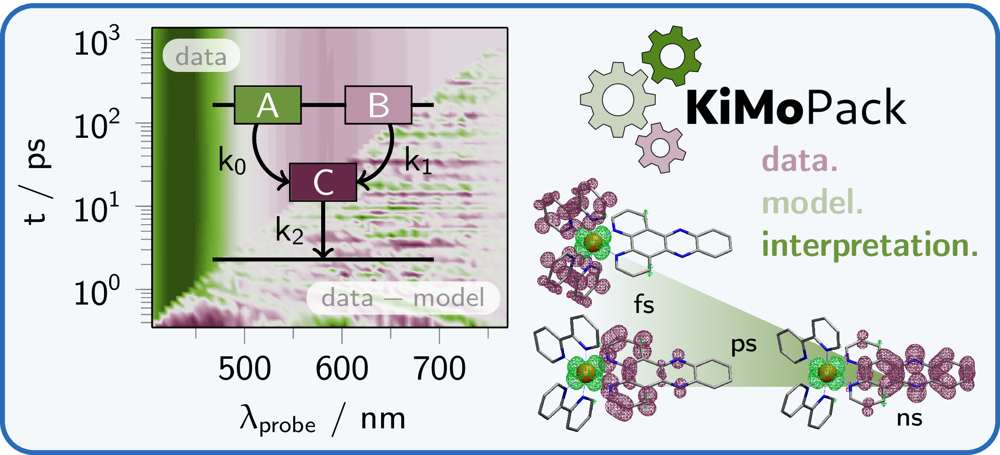
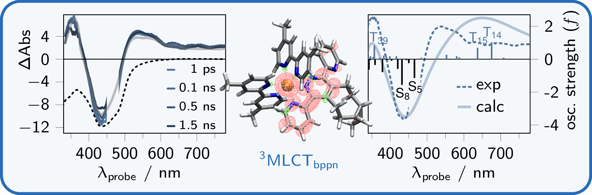
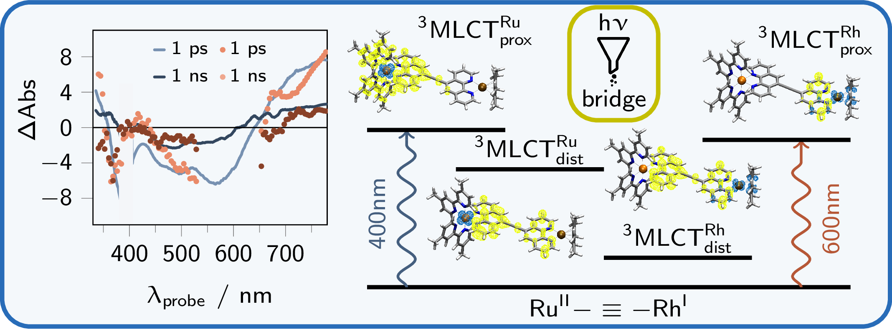
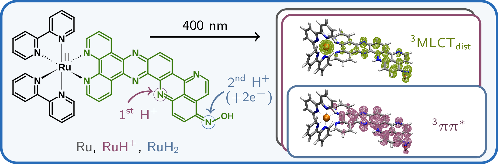
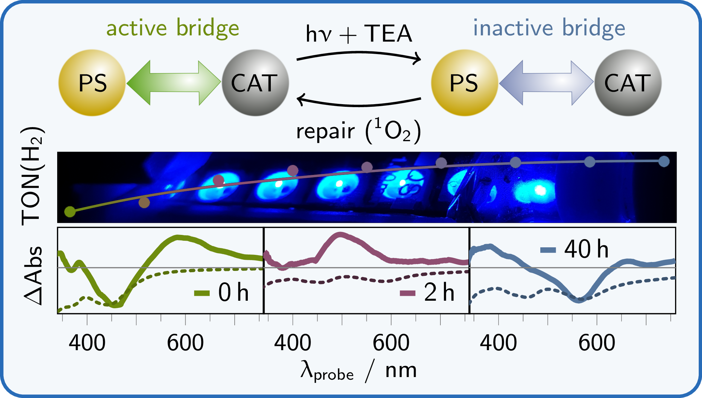
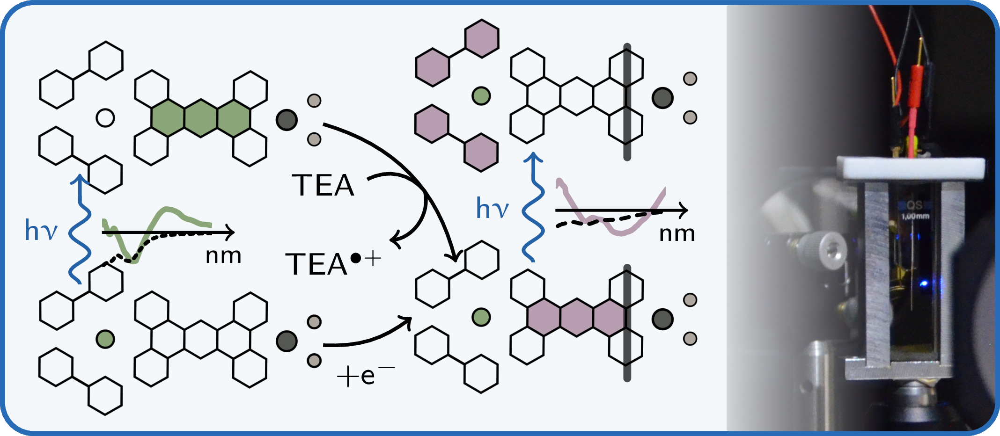

Currently, I have published 21 articles in peer-reviewed academic journals (*h*-index = 6) providing 2 (spectroscopic) datasets and 1 software ([*KiMoPack*](https://doi.org/10.1021/acs.jpca.2c00907)). For a full list of publications (including non-peer reviewed articles/preprints) see also [my Google Scholar profile](https://scholar.google.com/citations?hl=de&user=GTdILbgAAAAJ) and [my ResearchGate profile](https://www.researchgate.net/profile/Carolin-Mueller-6).

Last updated on 21 June 2022.

## Journal Articles  

## 2022   
#### total number: 7

> J. Brückmann, **C. Müller**, T. Maisuradze, A. K. Mengele, D. Nauroozi, S. Fauth, A. Gruber, S. Gräfe, K. Leopold, S. Kupfer, B. Dietzek-Ivanšić, S. Rau  
> *Pyrimidoquinazolinophenanthroline opens next chapter in design of bridging ligands for artificial photosynthesis*  
> [Chem. Eur. J. **2022**](https://doi.org/10.1002/chem.202200766)

>   
> **C. Müller**, T. Pascher, A. Eriksson, P. Chabera, J. Uhlig  
> *KiMoPack: A python Package for Kinetic Modeling of the Chemical Mechanism*  
> [J. Phys. Chem. A **2022**](https://doi.org/10.1021/acs.jpca.2c00907)
> [see post]({{ '_posts/2022-06-21-KiMoPack.html' | absolute_url }}).

>   
> **C. Müller**, P. Wintergerst, S. Santhosh Nair, N. Meitinger, S. Rau, B. Dietzek-Ivanšić  
> *Link to glow - iEDDA conjugation of a Ruthenium(II) tetrazine complex leading to dihydropyrazine and pyrazine complexes with improved 1O2 formation ability*  
> [J. Photochem. Photobiol, 11, 100130 **2022**](https://doi.org/10.1016/j.jpap.2022.100130)

>   
> L. Zedler, **C. Müller**, P. Wintergerst, A. K. Mengele, S. Rau, B. Dietzek-Ivanšić  
> *Influence of the linker chemistry on the photoinduced charge-transfer dynamics of heterodinuclear photocatalysts*  
> [Chem. Eur. J. **2022**, e202200490](https://doi.org/10.1002/chem.202200490)

> L. Zedler, P. Wintergerst, A. K. Mengele, **C. Müller**, C. Li, B. Dietzek-Ivanšić, S. Rau  
> *Outpacing conventional nicotinamide hydrogenation catalysis by a strongly communicating heterodinuclear photocatalyst*  
> [Nat. Commun. 13, 2538 **2022**](https://doi.org/10.1038/s41467-022-30147-4)

>   
> **C. Müller**, A. Schwab, N. M. Randell, S. Kupfer, B. Dietzek-Ivanšić, M. Chavarot-Kerlidou  
> *A Combined Spectroscopic and Theoretical Study on a Ruthenium Complex Featuring a π-Extended dppz Ligand for Light-Driven Accumulation of Multiple Reducing Equivalents*  
> [Chem. Eur. J. **2022**, e202103882](https://doi.org/10.1002/chem.202103882)

>   
> M. G. Pfeffer, **C. Müller**, E. T. E. Kastl, A. K. Mengele, B. Bagemihl, S. S. Fauth, J. Habermehl, L. Petermann, M. Wächtler, M. Schulz, D. Chartrand, F. Laverdière, P. Seeber, S. Kupfer, S. Gräfe, G. S. Hanan, J. G. Vos, B. Dietzek-Ivanšić, S. Rau  
> *Active repair of a dinuclear photocatalyst for visible-light-driven hydrogen production*  
> [Nat. Chem. **2022**](https://www.nature.com/articles/s41557-021-00860-6)

## 2021  
#### total number: 7

>   
> **C. Müller**, I. Friedländer, B. Bagemihl, S. Rau, B. Dietzek-Ivanšić  
> *The electron that breaks the catalyst’s back – excited state dynamics in intermediates of molecular photocatalysts*  
> [Phys. Chem. Chem. Phys. **2021**, *23*, 27397-27403](https://doi.org/10.1039/D1CP04498B)

> S. Maloul, M. van den Borg, **C. Müller**, L. Zedler, A. K. Mengele, D. Gaissmaier, T. Jacob, S. Rau, B. Dietzek-Ivanšić, C. Streb  
> *Multifunctional Polyoxometalate Platforms for Supramolecular Light‐driven Hydrogen Evolution*  
> [Chem. Eur. J. **2021**, *27*, 16846–16852](https://onlinelibrary.wiley.com/doi/10.1002/chem.202103817)

> E. Giannoudis, S. Bold, **C. Müller**, A. Schwab, J. Bruhnke, N. Queyriaux, C. Gablin, L. Didier, C. Saint-Pierre, D. Gasparutto, D. Aldakov, S. Kupfer, V. Artero, B. Dietzek, M. Chavarot-Kerlidou  
> *Hydrogen Production at a NiO Photocathode Based on a Ruthenium Dye–Cobalt Diimine Dioxime Catalyst Assembly: Insights from Advanced Spectroscopy and Post-operando Characterization*  
> [ACS Appl. Mater. Interfaces **2021**, *13*, 42, 49802-49815](https://pubs.acs.org/doi/10.1021/acsami.1c12138)

> B. Seidler, M. Sittig, C. Zens, J. H. Tran, **C. Müller**, Y. Zhang, K. R. A. Schneider, H. Görls, A. Schubert, S. Gräfe, M. Schulz, B. Dietzek  
> *Modulating the Excited-State Decay Pathways of Cu(I) 4 H -Imidazolate Complexes by Excitation Wavelength and Ligand Backbone*  
> [J. Phys. Chem. B **2021**, *125*, 41, 11498-11511](https://pubs.acs.org/doi/10.1021/acs.jpcb.1c06902)

> **C. Müller**, D. Isakov, S. Rau, B. Dietzek  
> *Influence of the Protonation State on the Excited-State Dynamics of Ruthenium(II) Complexes with Imidazole π-Extended Dipyridophenazine Ligands*  
> [J. Phys. Chem. A **2021**, *125*, 27, 5911-5921](https://pubs.acs.org/doi/10.1021/acs.jpca.1c03856)

> J. Hniopek, **C. Müller**, T. Bocklitz, M. Schmitt, B. Dietzek, J. Popp  
> *Kinetic-Model-Free Analysis of Transient Absorption Spectra Enabled by 2D Correlation Analysis*  
> [J. Phys. Chem. Lett. **2021**, *12*, 17, 4148-4153](https://pubs.acs.org/doi/10.1021/acs.jpclett.1c00835)

> M. Kaufmann, **C. Müller**, A. A. Cullen, M. P. Brandon, B. Dietzek, M. T. Pryce  
> *Photophysics of Ruthenium(II) Complexes with Thiazole π-Extended Dipyridophenazine Ligands*  
> [Inorg. Chem. **2021**, *60*, 2, 760-773](https://pubs.acs.org/doi/10.1021/acs.inorgchem.0c02765)

## 2020  
#### total number: 3

> A. K. Mengele, **C. Müller**, D. Nauroozi, S. Kupfer, B. Dietzek, S. Rau  
> *Molecular Scylla and Charybdis: Maneuvering between pH Sensitivity and Excited-State Localization in Ruthenium Bi(benz)imidazole Complexes*  
> [Inorg. Chem. **2020**, *59*, 12097–12110](https://pubs.acs.org/doi/10.1021/acs.inorgchem.0c01022)

> **C. Müller**, M. Schulz, M. Obst, L. Zedler, S. Gräfe, S. Kupfer, B. Dietzek  
> *Role of MLCT States in the Franck–Condon Region of Neutral, Heteroleptic Cu(I)-4H-imidazolate Complexes: A Spectroscopic and Theoretical Study*  
> [J. Phys. Chem. A **2020**, *124*, 33, 6607-6616](https://pubs.acs.org/doi/10.1021/acs.jpca.0c04351)

> R. A. Wahyuono, S. Amthor, **C. Müller**, S. Rau, B. Dietzek  
> *Structure of Diethyl-Phosphonic Acid Anchoring Group Affects the Charge-Separated State on an Iridium(III) Complex Functionalized NiO Surface*  
> [ChemPhotoChem **2020**, *4*, 8, 618–629](https://onlinelibrary.wiley.com/doi/abs/10.1002/cptc.202000038)

## 2017 – 2019  
#### total number: 4

> D. O’Connor, **C. Müller**, N. K. Sarangi, A. Byrne, T. E. Keyes  
> *Dimethylaniline functionalised pyrene fluorophores; dual colour pH switching in solution and self-assembled monolayers*  
> [PCCP **2019**, *21*, 40, 22440–22448](http://xlink.rsc.org/?DOI=C9CP04948G)

> K. Amini, M. Sclafani, T. Steinle, A. Le, A. Sanchez, **C. Müller**, J. Steinmetzer, L. Yue, J. R. Martínez Saavedra, 
M. Hemmer, M. Lewenstein, R. Moshammer, T. Pfeifer, M. G. Pullen, J. Ullrich, B. Wolter, R. Moszynski, F. J. García de Abajo, C. D. Lin, S. Gräfe, J. Biegert  
> *Imaging the Renner–Teller effect using laser-induced electron diffraction*  
> [PNAS **2019**, *116*, 17, 8173–8177](http://www.pnas.org/lookup/doi/10.1073/pnas.1817465116)

> M. Schulz, C. Reichardt, **C. Müller**, K. R. A. Schneider, J. Holste, B. Dietzek  
> *Excited State Properties of Heteroleptic Cu(I) 4H-Imidazolate Complexes*  
> [Inorg. Chem. **2017**, *56*, 21, 12978–12986](https://pubs.acs.org/doi/10.1021/acs.inorgchem.7b01680)

> H. Abul-Futouh, Y. Zagranyarski, **C. Müller**, M. Schulz, S. Kupfer, H. Görls, M. El-khateeb, S. Gräfe, B. Dietzek, K. Peneva, W. Weigand  
> *[FeFe]-Hydrogenase H-cluster mimics mediated by naphthalene monoimide derivatives of perisubstituted dichalcogenides*  
> [Dalt. Trans. **2017**, *46*, 34, 11180–11191](http://xlink.rsc.org/?DOI=C7DT02079A)

## Software and Data  

>  J. Uhlig, **C. Müller**, T. Pascher, A. Eriksson  
> *KiMoPack*  
> [Zenodo **2022**](https://doi.org/10.5281/zenodo.5720587)

> L. Zedler, P. Wintergerst, A. K. Mengele, **C. Müller**, C. Li, B. Dietzek-Ivanšić, S. Rau  
> *Which bridge to cross, which mountain to climb – supramolecular photocatalysis outpacing conventional catalysis*  
> [Zenodo **2022**](https://doi.org/10.5281/zenodo.5837779)

>  M. G. Pfeffer, **C. Müller**, E. T. E. Kastl, A. K. Mengele, B. Bagemihl, S. Fauth, J. Habermehl, L. Petermann, M. Wächtler, M. Schulz, D. Chartrand, F. Laverdière, P. Seeber, S. Kupfer, S. Gräfe, G. S. Hanan, J. G. Vos, B. Dietzek-Ivanšić, S. Rau  
> *Active repair of a dinuclear photocatalyst for visible light-driven hydrogen production*  
> [Zenodo **2021**](https://doi.org/10.5281/zenodo.5565022)

## Conference Publications  

>  M. Petersen, C. Müller, M. Wejner, S. Rau, B. Dietzek-Ivanšić, T. Wilke  
> *Photoprocesses in chemistry education – Tracing photochemical reactions with a digital low-cost photometer*  
> [In: International Conference Proceedings. New Perspectives in Science Education 11th Edition. Hybrid Event, 17-18 March 2022. Pixel (Hrsg.). Filodiritto Publisher, Bologna, 110–115, **2022**](https://conference.pixel-online.net/NPSE/files/npse/ed0011/FP/3357-CHEM5454-FP-NPSE11.pdf)

_________

For a list of publications see also [my Google Scholar profile](https://scholar.google.com/citations?hl=de&user=GTdILbgAAAAJ) and [my ResearchGate profile](https://www.researchgate.net/profile/Carolin-Mueller-6).

[Back]({{ '/' | absolute_url }})
